# Obsidian 图谱入口

本文档用于在 Obsidian 中查看 `docs/vibe-graph/` 的关系图谱。

## 使用方式

1. 在 Obsidian 中打开仓库根目录 `D:/AgentHub` 作为 vault。
2. 打开 `docs/vibe-graph/obsidian.md`。
3. 使用 Obsidian Graph View 查看 `SPEC`、`PLAN`、`TASK`、`TRACE` 之间的双链关系。

## 双链约定

每个图谱节点正文末尾应包含：

```md
## Obsidian 双链

Related:

- [[SPEC-...]]
- [[PLAN-...]]
- [[TASK-...]]
- [[TRACE-...]]
```

YAML frontmatter 负责机器校验，Obsidian 双链负责可视化浏览。两者表达同一组关系，但用途不同。

## 当前试点

- [[SPEC-AICOLLAB-VIBE-GRAPH-001]]
- [[PLAN-AICOLLAB-VIBE-GRAPH-001]]
- [[TASK-AICOLLAB-VIBE-GRAPH-001]]
- [[TASK-AICOLLAB-VIBE-GRAPH-002]]
- [[TASK-AICOLLAB-VIBE-GRAPH-003]]
- [[TASK-AICOLLAB-VIBE-GRAPH-004]]
- [[TASK-AICOLLAB-VIBE-GRAPH-005]]
- [[TRACE-AICOLLAB-VIBE-GRAPH-001]]
- [[SPEC-GROUPCHAT-DAG-001]]
- [[PLAN-GROUPCHAT-DAG-001]]
- [[TASK-GROUPCHAT-DAG-001]]
- [[TASK-GROUPCHAT-DAG-002]]
- [[TASK-GROUPCHAT-DAG-003]]
- [[TASK-GROUPCHAT-DAG-004]]
- [[TASK-GROUPCHAT-DAG-005]]
- [[TASK-GROUPCHAT-DAG-006]]
- [[TASK-GROUPCHAT-DAG-007]]
- [[TASK-GROUPCHAT-DAG-008]]
- [[TRACE-GROUPCHAT-DAG-001]]
- [[SPEC-PREVIEW-PPT-INLINE-001]]
- [[PLAN-PREVIEW-PPT-INLINE-001]]
- [[TASK-PREVIEW-PPT-INLINE-001]]
- [[TASK-PREVIEW-PPT-INLINE-002]]
- [[TASK-PREVIEW-PPT-INLINE-003]]
- [[TASK-PREVIEW-PPT-INLINE-004]]
- [[TASK-PREVIEW-PPT-INLINE-005]]
- [[TASK-PREVIEW-PPT-INLINE-006]]
- [[TRACE-PREVIEW-PPT-INLINE-001]]
- [[SPEC-ARTIFACT-RICH-CARD-001]]
- [[PLAN-ARTIFACT-RICH-CARD-001]]
- [[TRACE-ARTIFACT-RICH-CARD-001]]
- [[SPEC-DIFF-APPLY-SOURCE-001]]
- [[PLAN-DIFF-APPLY-SOURCE-001]]
- [[TRACE-DIFF-APPLY-SOURCE-001]]
- [[SPEC-DEPLOYMENT-PREVIEW-001]]
- [[PLAN-DEPLOYMENT-PREVIEW-001]]
- [[TRACE-DEPLOYMENT-PREVIEW-001]]
- [[SPEC-ARTIFACT-EDIT-WRITEBACK-001]]
- [[PLAN-ARTIFACT-EDIT-WRITEBACK-001]]
- [[TASK-ARTIFACT-EDIT-WRITEBACK-001]]
- [[TASK-ARTIFACT-EDIT-WRITEBACK-002]]
- [[TASK-ARTIFACT-EDIT-WRITEBACK-003]]
- [[TASK-ARTIFACT-EDIT-WRITEBACK-004]]
- [[TRACE-ARTIFACT-EDIT-WRITEBACK-001]]
- [[SPEC-AGENT-MANAGEMENT-001]]
- [[PLAN-AGENT-MANAGEMENT-001]]
- [[TASK-AGENT-MANAGEMENT-001]]
- [[TASK-AGENT-MANAGEMENT-002]]
- [[TASK-AGENT-MANAGEMENT-003]]
- [[TASK-AGENT-MANAGEMENT-004]]
- [[TASK-AGENT-MANAGEMENT-005]]
- [[TASK-AGENT-MANAGEMENT-006]]
- [[TRACE-AGENT-MANAGEMENT-001]]
- [[SPEC-CONVERSATION-MESSAGE-PIN-001]]
- [[PLAN-CONVERSATION-MESSAGE-PIN-001]]
- [[TASK-CONVERSATION-MESSAGE-PIN-001]]
- [[TASK-CONVERSATION-MESSAGE-PIN-002]]
- [[TASK-CONVERSATION-MESSAGE-PIN-003]]
- [[TASK-CONVERSATION-MESSAGE-PIN-004]]
- [[TASK-CONVERSATION-MESSAGE-PIN-005]]
- [[TASK-CONVERSATION-MESSAGE-PIN-006]]
- [[TRACE-CONVERSATION-MESSAGE-PIN-001]]

## Mermaid 总览

```mermaid
flowchart TD
  ASPEC["SPEC-AICOLLAB-VIBE-GRAPH-001"]
  APLAN["PLAN-AICOLLAB-VIBE-GRAPH-001"]
  ATRACE["TRACE-AICOLLAB-VIBE-GRAPH-001"]
  AT1["TASK-AICOLLAB-VIBE-GRAPH-001"]
  AT2["TASK-AICOLLAB-VIBE-GRAPH-002"]
  AT3["TASK-AICOLLAB-VIBE-GRAPH-003"]
  AT4["TASK-AICOLLAB-VIBE-GRAPH-004"]
  AT5["TASK-AICOLLAB-VIBE-GRAPH-005"]

  SPEC["SPEC-GROUPCHAT-DAG-001"]
  PLAN["PLAN-GROUPCHAT-DAG-001"]
  TRACE["TRACE-GROUPCHAT-DAG-001"]

  T1["TASK-GROUPCHAT-DAG-001"]
  T2["TASK-GROUPCHAT-DAG-002"]
  T3["TASK-GROUPCHAT-DAG-003"]
  T4["TASK-GROUPCHAT-DAG-004"]
  T5["TASK-GROUPCHAT-DAG-005"]
  T6["TASK-GROUPCHAT-DAG-006"]
  T7["TASK-GROUPCHAT-DAG-007"]
  T8["TASK-GROUPCHAT-DAG-008"]

  PSPEC["SPEC-PREVIEW-PPT-INLINE-001"]
  PPLAN["PLAN-PREVIEW-PPT-INLINE-001"]
  PTRACE["TRACE-PREVIEW-PPT-INLINE-001"]
  PT1["TASK-PREVIEW-PPT-INLINE-001"]
  PT2["TASK-PREVIEW-PPT-INLINE-002"]
  PT3["TASK-PREVIEW-PPT-INLINE-003"]
  PT4["TASK-PREVIEW-PPT-INLINE-004"]
  PT5["TASK-PREVIEW-PPT-INLINE-005"]
  PT6["TASK-PREVIEW-PPT-INLINE-006"]

  RSPEC["SPEC-ARTIFACT-RICH-CARD-001"]
  RPLAN["PLAN-ARTIFACT-RICH-CARD-001"]
  RTRACE["TRACE-ARTIFACT-RICH-CARD-001"]

  DSPEC["SPEC-DIFF-APPLY-SOURCE-001"]
  DPLAN["PLAN-DIFF-APPLY-SOURCE-001"]
  DTRACE["TRACE-DIFF-APPLY-SOURCE-001"]

  XSPEC["SPEC-DEPLOYMENT-PREVIEW-001"]
  XPLAN["PLAN-DEPLOYMENT-PREVIEW-001"]
  XTRACE["TRACE-DEPLOYMENT-PREVIEW-001"]

  ESPEC["SPEC-ARTIFACT-EDIT-WRITEBACK-001"]
  EPLAN["PLAN-ARTIFACT-EDIT-WRITEBACK-001"]
  ETRACE["TRACE-ARTIFACT-EDIT-WRITEBACK-001"]
  ET1["TASK-ARTIFACT-EDIT-WRITEBACK-001"]
  ET2["TASK-ARTIFACT-EDIT-WRITEBACK-002"]
  ET3["TASK-ARTIFACT-EDIT-WRITEBACK-003"]
  ET4["TASK-ARTIFACT-EDIT-WRITEBACK-004"]

  MSPEC["SPEC-AGENT-MANAGEMENT-001"]
  MPLAN["PLAN-AGENT-MANAGEMENT-001"]
  MTRACE["TRACE-AGENT-MANAGEMENT-001"]
  MT1["TASK-AGENT-MANAGEMENT-001"]
  MT2["TASK-AGENT-MANAGEMENT-002"]
  MT3["TASK-AGENT-MANAGEMENT-003"]
  MT4["TASK-AGENT-MANAGEMENT-004"]
  MT5["TASK-AGENT-MANAGEMENT-005"]
  MT6["TASK-AGENT-MANAGEMENT-006"]

  CSPEC["SPEC-CONVERSATION-MESSAGE-PIN-001"]
  CPLAN["PLAN-CONVERSATION-MESSAGE-PIN-001"]
  CTRACE["TRACE-CONVERSATION-MESSAGE-PIN-001"]
  CT1["TASK-CONVERSATION-MESSAGE-PIN-001"]
  CT2["TASK-CONVERSATION-MESSAGE-PIN-002"]
  CT3["TASK-CONVERSATION-MESSAGE-PIN-003"]
  CT4["TASK-CONVERSATION-MESSAGE-PIN-004"]
  CT5["TASK-CONVERSATION-MESSAGE-PIN-005"]
  CT6["TASK-CONVERSATION-MESSAGE-PIN-006"]

  ASPEC --> APLAN
  APLAN --> AT1
  APLAN --> AT2
  APLAN --> AT3
  APLAN --> AT4
  APLAN --> AT5
  AT1 --> ATRACE
  AT2 --> ATRACE
  AT3 --> ATRACE
  AT4 --> ATRACE
  AT5 --> ATRACE

  SPEC --> PLAN
  PLAN --> T1
  PLAN --> T2
  PLAN --> T3
  PLAN --> T4
  PLAN --> T5
  PLAN --> T6
  PLAN --> T7
  PLAN --> T8

  T1 --> TRACE
  T2 --> TRACE
  T3 --> TRACE
  T4 --> TRACE
  T5 --> TRACE
  T6 --> TRACE
  T7 --> TRACE
  T8 --> TRACE

  T2 -. depends_on .-> T1
  T3 -. relates_to .-> T4
  T3 -. relates_to .-> T5
  T4 -. depends_on .-> T3
  T5 -. depends_on .-> T3
  T6 -. depends_on .-> T4
  T8 -. depends_on .-> T3
  T8 -. depends_on .-> T6

  PSPEC --> PPLAN
  PPLAN --> PT1
  PPLAN --> PT2
  PPLAN --> PT3
  PPLAN --> PT4
  PPLAN --> PT5
  PPLAN --> PT6
  PT1 --> PTRACE
  PT2 --> PTRACE
  PT3 --> PTRACE
  PT4 --> PTRACE
  PT5 --> PTRACE
  PT6 --> PTRACE

  ASPEC -. relates_to .-> SPEC
  ASPEC -. relates_to .-> PSPEC
  AT4 -. creates example .-> PSPEC
  PSPEC -. relates_to .-> ASPEC

  RSPEC --> RPLAN
  RPLAN --> RTRACE
  DSPEC --> DPLAN
  DPLAN --> DTRACE
  XSPEC --> XPLAN
  XPLAN --> XTRACE

  RSPEC -. depends_on .-> SPEC
  DSPEC -. depends_on .-> RSPEC
  XSPEC -. depends_on .-> RSPEC
  PSPEC -. relates_to .-> RSPEC

  ESPEC --> EPLAN
  EPLAN --> ET1
  EPLAN --> ET2
  EPLAN --> ET3
  EPLAN --> ET4
  ET1 --> ETRACE
  ET2 --> ETRACE
  ET3 --> ETRACE
  ET4 --> ETRACE
  ESPEC -. depends_on .-> RSPEC
  ESPEC -. relates_to .-> DSPEC

  MSPEC --> MPLAN
  MPLAN --> MT1
  MPLAN --> MT2
  MPLAN --> MT3
  MPLAN --> MT4
  MPLAN --> MT5
  MPLAN --> MT6
  MT1 --> MTRACE
  MT2 --> MTRACE
  MT3 --> MTRACE
  MT4 --> MTRACE
  MT5 --> MTRACE
  MT6 --> MTRACE
  MSPEC -. relates_to .-> SPEC

  CSPEC --> CPLAN
  CPLAN --> CT1
  CPLAN --> CT2
  CPLAN --> CT3
  CPLAN --> CT4
  CPLAN --> CT5
  CPLAN --> CT6
  CT1 --> CTRACE
  CT2 --> CTRACE
  CT3 --> CTRACE
  CT4 --> CTRACE
  CT5 --> CTRACE
  CT6 --> CTRACE
  CSPEC -. depends_on .-> MSPEC
  CSPEC -. relates_to .-> SPEC
  CSPEC -. relates_to .-> ESPEC
```



## 维护规则

- 新建节点时，先填 frontmatter，再补 `## Obsidian 双链`。
- 双链应引用稳定 ID，不引用中文标题。
- 删除或重命名节点 ID 时，必须同步更新所有双链。
- 修改后运行：

```powershell
python docs/vibe-graph/scripts/validate-vibe-graph.py docs/vibe-graph
```

